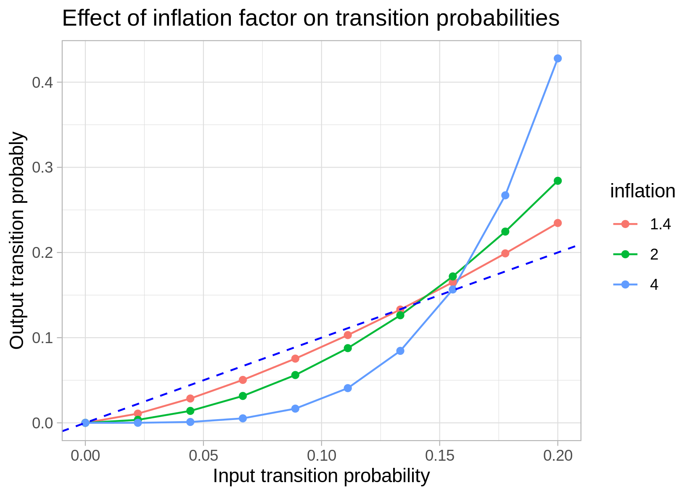

[](https://travis-ci.com/dariober/snakemake-mcl-cluster)
[](https://www.java.com/)
[](https://github.com/dariober/snakemake-mcl-cluster)

<!-- vim-markdown-toc GFM -->

* [Description & Motivation](#description--motivation)
* [Installation](#installation)
* [Input](#input)
* [Execution](#execution)
* [Output](#output)
* [Markov Clustering Algorithm](#markov-clustering-algorithm)
* [Developer memo](#developer-memo)

<!-- vim-markdown-toc -->

# Description & Motivation

This pipeline performs Markov clustering via
[mcl](https://micans.org/mcl/index.html) on an array of parameters values and
reports summary statistics for each combination of settings. In this way it
is easy, hopefully, to:

* Perfom clustering from start to finish in a streamlined but customisable way

* Choose the optimal parameter settings

Although mcl clustering has virtually only one parameter to tweak - the
inflation factor - there are several pre- and post-processing parameters that
affect the clustering results.

---

At the present these below are the parameters that be varied. Additional or
different ones could be included by editing the Snakefile.

* `pearson_r_cutoff: [0.6, 0.75, 0.9]`: Reset to 0 correlations below this
  cutoff. Cutoffs closer to 1 favour many clusters of small size, possibly
  resulting in too many singletons. Cutoffs closer to 0 favour big clusters.
  This transformation is applied before clustering.

* `inflation: [1.4, 1.6, 1.8, 2, 4]`: Each element of the transition matrix is
  raised to this power. Therefore, higher inflation makes strong links stronger
  and weak links weaker. High inflation factors favour small, tight cluster
  possibly giving too many tiny clusters

* `ceilnb: [50, 100, 500, 10000]` This parameter prevents nodes from having too many
  connection, quoting the [manual](https://micans.org/mcl/man/mcl.html) *ceilnb
  removes edges from nodes of highest degree first, proceeding until all node
  degrees satisfy the given threshold*. Lower values give smaller clusters
  while high values effectively disable this transformation.

----

mcl is very fast unless you hit some corner-case parameter values. In fact, mcl
taking a long time to complete may be an indication that the selected
parameters are unsuitable. However, since **all** combinations of parameters
are tested, the number of executions grows very fast.

The `Snakefile` is the core of the pipeline and it should be readable even if
you don't use [snakemake](https://snakemake.readthedocs.io/en/stable/). 

# Installation

`requirements.txt` contains the list of dependencies with their versions. Using
these exact programs versions is probably not necessary.

The easiest way to install the dependencies is via
[conda/bioconda](https://bioconda.github.io/user/install.html). Consider using
[mamba install](https://github.com/mamba-org/mamba) instead of `conda install`.

You may want to create a dedicated environment with all the dependencies,
although this is not necessary.

```
conda create --yes -n snakemake-mcl-cluster
conda activate snakemake-mcl-cluster
mamba install --yes -n snakemake-mcl-cluster --file requirements.txt --freeze-installed
```

Alternatively, install the required programs using your favourite method.

# Input

The only input is a matrix where rows are vectors of observations (e.g. genes)
and columns are dimensions (e.g. samples). The example `data/logrpkm.tsv` is a
gene expression matrix where expression is log2(RPKM) from RNAseq. If
interested, the file `counts.tsv.gz` has the raw counts. Note that it may or
may not be sensible to cluster this dataset.

I have prepared `snakemake-mcl-cluster` for clustering gene expression but
there is nothing specific to gene expression analysis in this workflow.

# Execution

Edit `params.yml` to specify the input file of gene expression and the lists
of parameters. Then run the pipeline with:

```
snakemake --dry-run --printshellcmds \
    --jobs 5 \
    --configfile params.yml \
    --directory ./
```

This should run using the example data included in this repository.

`--dry-run`: Only show would would be done - remove this option for actual execution

`--printshellcmds`: Show the shell commands as they are executed

`--jobs`: Number of jobs to run in parallel - edit as appropriate

`--directory`: Change to this directory and write output here. Created if it does not exist

`--config`: Configuration file

There are several intermediate files that are automatically deleted. To keep
these files add the `--notemp` option to snakemake or edit the Snakefile to
remove the `temp()` function around the intermediate files to keep.

# Output

The pipeline output is: 

* `cluster_summary.tsv`: A table of cluster characteristics for each combination of parameter values
  that should help deciding the optimal combination

* `distance_between_clusters.tsv`: Table of metrics for the consistency between
  clusters for each pair of parameter settings

* `/Pearson_{r}/I_{i}/ceilnb_{nb}/cluster.tsv`: For each combination of
  parameters, a cluster file ready for further analyses

* `similarity_matrix.tsv.gz`: The similarity matrix produced from the input
  data. Unless you changed the `mcxarray` command, this is the correlation
  matrix with correlations below |0.2| reset to zero.

----

This is an example of (part of) `cluster_summary.tsv` using the input data
accompanying this repository. *NB* I'm not sure if this input data contains
clusters or if mcl with these settings is the best approach.

This table is sorted by `pct_genes_regular` so that the first rows are the
combinations favouring clusters of "regular" size (see `params.yml`). Note
that depending on the choice of parameters you can obtain many tiny clusters or
few big ones.

Columns are:

* `corr`, `inflation`, `ceilnb`: The combination of settings

* `n_clusters`: Number of clusters

* `pct_genes_regular`: % of genes (or whatever you are clustering) in clusters
  of "regular" size, i.e. between 15 and 200 (see `params.yml` to adjust).
  Typically you hope for most/many genes to be these clusters of manageable
  size and number

* `pct_genes_bigk`: % genes in the top 3 biggest clusters. High
  `pct_genes_bigk` means that the few biggest clusters contain most of the
  genes. The gene network is a hairball without distinct modules.

* `pct_genes_smallk`: % genes in small clusters (clusters with <= 3 genes). Too
  many genes in this category probably means the cluster settings are too
  strict to allow clusters to form.

In practice, choose settings that are plausible and give clusters that are both
plausible and useful.

```
    corr inflation ceilnb n_clusters pct_genes_regular pct_genes_bigk pct_genes_smallk
 1: 0.60       2.0     50        213              89.0           13.0              3.3
 2: 0.75       2.0     50        367              77.0           12.0              6.9
 3: 0.60       1.8     50         75              75.6           21.4              0.4
 4: 0.75       1.8     50        269              67.7           18.4              4.8
 5: 0.75       2.0    100        300              57.1           21.6              5.8
 6: 0.60       2.0    100         61              47.2           33.3              0.4
 7: 0.75       1.8    100        234              38.5           34.0              3.9
 8: 0.60       4.0    500        427              36.8           36.1              9.8
 9: 0.75       4.0    500       1102              35.6           18.3             31.8
10: 0.75       4.0  10000       1096              34.6           18.8             31.5
11: 0.75       1.6     50        183              33.3           32.9              3.0
12: 0.75       2.0  10000        280              30.6           37.1              5.5
13: 0.90       1.4     50       2153              30.4           17.6             49.0
14: 0.75       2.0    500        283              30.0           37.8              5.6
15: 0.90       1.6     50       2226              29.9           13.0             51.7
16: 0.90       1.6    100       2225              29.4           13.2             51.5
17: 0.90       1.6  10000       2226              29.3           13.3             51.6
18: 0.90       1.6    500       2226              29.3           13.3             51.6
19: 0.60       1.6     50         34              25.9           45.9              0.1
20: 0.75       1.8  10000        232              25.2           56.8              4.6
21: 0.75       1.8    500        233              25.0           52.3              4.7
22: 0.90       1.8  10000       2283              24.4           11.9             53.6
23: 0.90       1.8    500       2283              24.4           11.9             53.6
24: 0.90       1.8    100       2285              24.1           11.4             53.7
25: 0.90       1.8     50       2286              23.6           10.0             53.6
26: 0.90       2.0     50       2335              22.0            9.0             55.6
27: 0.90       2.0  10000       2331              21.9            9.9             55.4
28: 0.90       2.0    500       2331              21.9            9.9             55.4
29: 0.90       2.0    100       2337              21.7            9.6             55.8
30: 0.90       1.4    100       2154              21.2           18.1             49.0
31: 0.90       1.4  10000       2153              19.7           19.1             49.1
32: 0.90       1.4    500       2153              19.7           19.1             49.1
33: 0.60       4.0  10000        368              19.4           55.3              8.9
34: 0.75       1.4    500        122              18.4           84.7              2.1
35: 0.75       1.4  10000        122              17.9           85.1              2.1
36: 0.75       1.6    500        171              17.4           61.8              3.0
37: 0.75       1.6  10000        171              17.3           61.9              3.0
38: 0.75       1.6    100        174              16.7           36.8              2.9
39: 0.75       1.4     50        127              16.5           60.2              2.2
40: 0.75       4.0    100       1867              16.3            7.3             52.8
41: 0.60       1.8    100         35              13.7           40.5              0.3
42: 0.60       4.0    100       2792              12.1            7.3             72.2
43: 0.75       1.4    100        123              11.5           77.1              2.0
44: 0.60       1.6    100         24               8.5           59.7              0.1
45: 0.90       4.0  10000       2683               8.2            6.0             70.9
46: 0.90       4.0    500       2683               8.2            6.0             70.9
47: 0.90       4.0    100       2685               8.1            5.5             70.7
48: 0.60       2.0  10000         33               6.2           92.9              0.5
49: 0.60       1.4     50         13               6.2           74.0              0.0
50: 0.60       2.0    500         35               5.5           91.7              0.4
51: 0.75       4.0     50       2565               5.3            3.2             71.9
52: 0.90       4.0     50       2728               4.9            3.1             71.8
53: 0.60       1.8  10000         20               4.6           96.0              0.2
54: 0.60       1.4    500          6               4.4           99.9              0.1
55: 0.60       1.8    500         21               4.0           94.4              0.2
56: 0.60       4.0     50       3630               3.7            3.4             88.0
57: 0.60       1.4  10000          6               3.5           99.9              0.1
58: 0.60       1.6  10000         14               2.1           98.3              0.1
59: 0.60       1.6    500         15               2.1           98.2              0.1
60: 0.60       1.4    100          8               0.7           90.6              0.0
    corr inflation ceilnb n_clusters pct_genes_regular pct_genes_bigk pct_genes_smallk
```

# Markov Clustering Algorithm

Your primary reference for MCL should be https://micans.org/mcl/ and
references therein. Here's my informal understanding.

Markov clustering is actually very simple. Starting with a similarity matrix M,
for example a matrix of Person correlation coefficients between genes:

* Rescale the columns of M by dividing each element by the column sum. This
  turns M into a transition matrix stating for each gene (column) the
  probability of interacting with any other gene (rows). In R this rescaling
  would be `M <- t(t(M)/colSums(M))`

* "Evolve" the transition matrix by multiplying it by itself. This step is
  called expansion. The result is again a transition matrix stating the new
  probability of interaction of each gene with the other genes.
  In R: `M <- M %*% M`

* Inflate the links between genes by elevating each entry of M to the power of
  I, I being the inflation factor. In R: `M <- M^inflFact`. Since the entries
  of M are between 0 and 1 and I is > 1, the inflation makes strong links
  stronger and weak links weaker (see below)

* Repeat the previous 3 steps until all the entries in M are either 0 or 1. At
  this point each column will be all zeros except in one row and it cannot
  evolve anymore. Reading this matrix row by row gives the output clusters,
  i.e. the rows containing one or more 1s.

This is the effect of the inflation factors on a vector of input transition
probabilities:



```
R
library(ggplot2)
library(data.table)

input_prob <- seq(0, 0.1, length.out= 10)
input_prob <- input_prob / sum(input_prob)

inflation <- c(1.4, 2, 4)
dat <- data.table(
    inflation= rep(inflation, each= length(input_prob)),
    input_prob= rep(input_prob, length(inflation))
    )
dat[, output_prob := input_prob^dat$inflation]
dat[, tot := sum(output_prob), by= inflation]
dat[, output_prob := output_prob / tot]
dat[, tot := NULL]
dat[, inflation := as.factor(inflation)]

gg <- ggplot(data= dat, aes(x= input_prob, y= output_prob, colour= inflation, group= inflation)) +
    geom_line() +
    geom_point() +
    geom_abline(slope= 1, intercept= 0, linetype= 'dashed', colour= 'blue') +
    theme_light() +
    xlab('Input transition probability') +
    ylab('Output transition probably') +
    ggtitle('Effect of inflation factor on transition probabilities')
ggsave('figures/inflation_effect.png', width= 14, height= 10, units= 'cm')
```

Developer memo
==============

Remember to update the string variable `GITHUB_REPOSITORY` with the appropriate
sha when pushing changes to repository.


